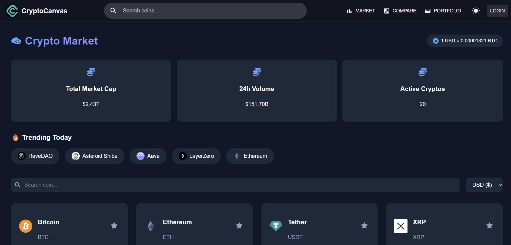
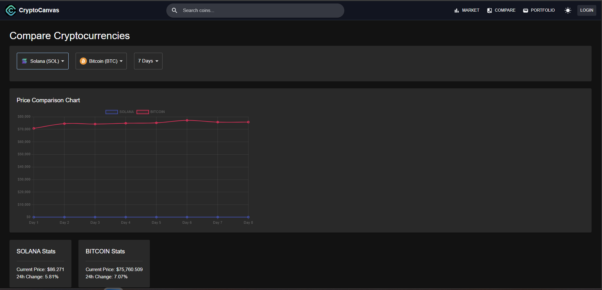
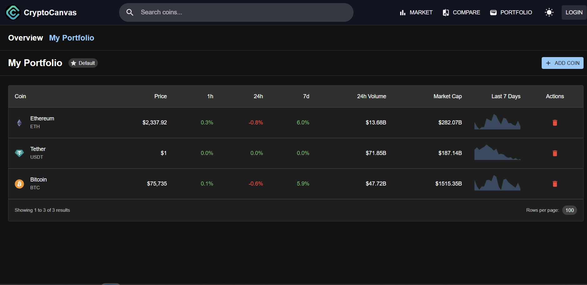
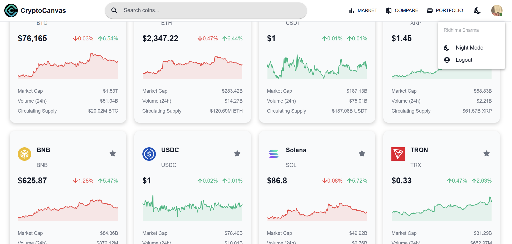

🚀 CryptoCanvas

A modern cryptocurrency dashboard built using React and Vite that provides a clean trading-style interface and real-time insights.

---

🌐 Live Demo

🔗 https://cryptocanvas-one.vercel.app/

---

📌 Features

* 📊 Interactive dashboard UI
* 💼 Portfolio-style layout
* 🌙 Clean dark-themed design
* ⚡ Fast performance using Vite

---
🛠️ Tech Stack

* React.js
* Vite
* JavaScript
* CSS

## 📸 Screenshots

### 🏠 Landing Page

### 📊 Market Overview

### 🔍 Comparison Feature

### 💼 Portfolio Dashboard

### 🌗 Theme Toggle (Dark/Light Mode)

---

⚙️ Run Locally

git clone https://github.com/heyridhima/cryptocanvas.git
cd cryptocanvas
npm install
npm run dev 

👩‍💻 Author
Ridhima Sharma
